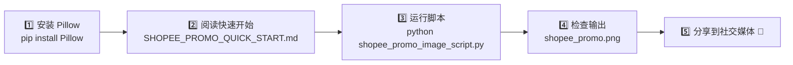
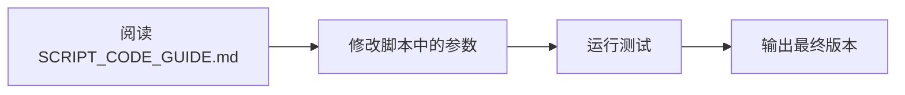

# 📁 Shopee 促销图片脚本 - 文件索引

## 🎯 快速导航

| 需求 | 推荐文件 | 用时 |
|------|---------|------|
| **快速上手** | `SHOPEE_PROMO_QUICK_START.md` | 5分钟 |
| **详细说明** | `SHOPEE_PROMO_SCRIPT_README.md` | 15分钟 |
| **代码修改** | `SCRIPT_CODE_GUIDE.md` | 20分钟 |
| **故障排除** | `SHOPEE_PROMO_USAGE_SUMMARY.txt` | 按需 |
| **直接运行** | `shopee_promo_image_script.py` | 1分钟 |

---

## 📦 完整文件清单

### 🔧 核心脚本和数据

```
memetalk/
├── shopee_promo_image_script.py          主脚本 (~8 KB)
│   ├── create_arrow()                    绘制箭头
│   ├── get_font()                        获取字体
│   └── create_shopee_promo()             核心主函数
│
├── input_file_12.jpeg                    ✅ 产品图 (216 KB)
│   └── 内容: P&G 4D 洗衣球各款产品展示
│
└── input_file_16.jpeg                    ✅ 後台截圖 (438 KB)
    └── 内容: 蝦皮商品促销信息页面
```

### 📚 文档和指南

```
memetalk/
├── SHOPEE_PROMO_QUICK_START.md           ⭐ 5分钟快速开始
│   ├── 环境检查
│   ├── 安装步骤
│   ├── 运行示例
│   ├── 常见问题
│   └── 下一步建议
│
├── SHOPEE_PROMO_SCRIPT_README.md         📖 完整文档
│   ├── 功能特性
│   ├── 使用方法
│   ├── 参数说明
│   ├── 文件准备
│   ├── 脚本特性
│   ├── 常见问题
│   └── 高级定制
│
├── SCRIPT_CODE_GUIDE.md                  🔍 代码解析
│   ├── 脚本结构
│   ├── 函数详解
│   ├── 颜色参考
│   ├── 尺寸比例
│   ├── 定制方案
│   ├── 调试技巧
│   └── 高级应用
│
├── SHOPEE_PROMO_USAGE_SUMMARY.txt        📋 使用总结
│   ├── 文件清单
│   ├── 3步快速开始
│   ├── 海报内容说明
│   ├── 命令行用法
│   ├── 故障排除
│   ├── 系统需求检查
│   └── 支持信息
│
└── SHOPEE_PROMO_FILES_INDEX.md           📇 文件索引 (本文件)
    └── 文件位置和用途说明
```

### 📁 输出文件（自动生成）

```
memetalk/
└── shopee_promo.png                      ✨ 最终海报
    ├── 尺寸: 1080 × 1920 像素 (9:16)
    ├── 格式: PNG (RGB)
    ├── 质量: 高质量 (95)
    └── 文件大小: ~200-500 KB
```

---

## 🚀 使用流程

### 第一次使用（初始设置）



### 后续使用（重复生成）


### 需要定制时



---

## 📖 文档详细说明

### 📌 SHOPEE_PROMO_QUICK_START.md
- **适合人群**: 想快速上手的用户
- **主要内容**:
  - 已准备的文件说明
  - 3 个运行方法
  - 脚本功能一览
  - 常见 5 个问题的解答
- **阅读时间**: 5-10 分钟
- **预期效果**: 能够立即运行脚本生成海报

### 📖 SHOPEE_PROMO_SCRIPT_README.md
- **适合人群**: 需要完整了解功能的用户
- **主要内容**:
  - 详细的功能特性说明
  - 完整的使用方法
  - 参数详解表
  - 文件准备指南
  - 脚本特性（字体、响应式布局等）
  - 完整的常见问题 (8+ 个)
  - 高级定制选项
- **阅读时间**: 15-20 分钟
- **预期效果**: 充分了解脚本所有功能和定制选项

### 🔍 SCRIPT_CODE_GUIDE.md
- **适合人群**: 想修改脚本代码的用户
- **主要内容**:
  - 脚本内部工作原理详解
  - 每个函数的详细说明和示例
  - 颜色 RGB 和十六进制参考
  - 布局尺寸和比例参考表
  - 5+ 个常见定制方案（含代码示例）
  - 调试和逐步测试技巧
  - 高级应用（滤镜、动态大小等）
- **阅读时间**: 20-30 分钟
- **预期效果**: 能够独立修改和扩展脚本

### 📋 SHOPEE_PROMO_USAGE_SUMMARY.txt
- **适合人群**: 需要快速参考和故障排除的用户
- **主要内容**:
  - 完整的文件清单
  - 3 步快速开始流程
  - 海报内容布局说明
  - 命令行用法和示例
  - 详细的故障排除指南
  - 系统需求检查清单
  - 常见使用场景
  - 应用场景说明
- **阅读时间**: 按需查阅
- **预期效果**: 快速找到所需信息或解决问题

---

## 🔑 关键要点快速查找

| 我想要 | 查看文件 | 位置 |
|--------|---------|------|
| 快速上手 | QUICK_START.md | 顶部 |
| 安装 Pillow | USAGE_SUMMARY.txt | "系统需求检查清单" |
| 改变颜色 | SCRIPT_CODE_GUIDE.md | "颜色参考" 表格 |
| 改变文字大小 | SCRIPT_CODE_GUIDE.md | "方案 2: 改变文字大小" |
| 改变海报大小 | SCRIPT_CODE_GUIDE.md | "尺寸和比例参考" |
| 修复乱码问题 | USAGE_SUMMARY.txt | "问题 3" |
| 支持多国语言 | SCRIPT_CODE_GUIDE.md | "高级技巧" 部分 |
| 批量生成 | SCRIPT_CODE_GUIDE.md | "高级技巧 4" |
| 添加滤镜 | SCRIPT_CODE_GUIDE.md | "高级技巧 2" |

---

## 💻 系统支持

### 支持的操作系统
- ✅ Windows (7/10/11)
- ✅ macOS (10.13+)
- ✅ Linux (Ubuntu/Debian/CentOS)

### 支持的 Python 版本
- ✅ Python 3.8+
- ✅ Python 3.9
- ✅ Python 3.10
- ✅ Python 3.11
- ✅ Python 3.12+

### 必需库
- **Pillow** >= 11.0 (用于图片处理)

### 推荐设置
- 至少 2GB 可用内存
- 至少 100MB 磁盘空间（用于输入和输出文件）
- 网络连接（可选，仅用于下载 Pillow）

---

## 📞 获取帮助

### 按问题类型查找

**安装和环境问题**
→ `SHOPEE_PROMO_USAGE_SUMMARY.txt` 中的"系统需求检查清单"和"故障排除"

**脚本使用问题**
→ `SHOPEE_PROMO_SCRIPT_README.md` 中的"常见问题"

**代码修改问题**
→ `SCRIPT_CODE_GUIDE.md` 中的"常见定制方案"和"调试技巧"

**快速问题**
→ `SHOPEE_PROMO_QUICK_START.md` 中的常见问题部分

---

## 📊 文件大小参考

| 文件 | 大小 | 类型 |
|------|------|------|
| shopee_promo_image_script.py | ~8 KB | Python 脚本 |
| input_file_12.jpeg | 216 KB | 图片（输入） |
| input_file_16.jpeg | 438 KB | 图片（输入） |
| SHOPEE_PROMO_QUICK_START.md | ~6 KB | 文本 |
| SHOPEE_PROMO_SCRIPT_README.md | ~12 KB | 文本 |
| SCRIPT_CODE_GUIDE.md | ~16 KB | 文本 |
| SHOPEE_PROMO_USAGE_SUMMARY.txt | ~8 KB | 文本 |
| shopee_promo.png（输出） | ~200-500 KB | 图片（输出） |

总计（输入文件）: ~660 KB  
总计（脚本和文档）: ~50 KB  
总计（含输出）: ~900 KB

---

## 🎯 典型用户路径

### 路径 A: 快速用户 (5-10 分钟)
1. 阅读 `SHOPEE_PROMO_QUICK_START.md` (3 分钟)
2. 安装 Pillow (2 分钟)
3. 运行脚本 (1 分钟)
4. 使用输出文件

### 路径 B: 全面用户 (30-40 分钟)
1. 阅读 `SHOPEE_PROMO_QUICK_START.md` (5 分钟)
2. 阅读 `SHOPEE_PROMO_SCRIPT_README.md` (15 分钟)
3. 安装和测试 (5 分钟)
4. 根据需要定制小部分 (10 分钟)

### 路径 C: 开发用户 (1-2 小时)
1. 快速概览所有文档 (20 分钟)
2. 深入学习 `SCRIPT_CODE_GUIDE.md` (30 分钟)
3. 修改和扩展脚本 (30-60 分钟)
4. 测试和优化 (20 分钟)

---

## 🔄 更新和维护

### 脚本版本
- **当前版本**: 1.0
- **发布日期**: 2026-06-30
- **维护状态**: 活跃

### 已知限制
- 目前不支持动画 GIF 输出
- 不支持透明背景 PNG（始终输出 RGB）
- 箭头绘制为直线（不支持曲线）

### 未来改进计划
- [ ] 支持更多的字体和语言
- [ ] 支持 GIF 动画输出
- [ ] 支持自定义背景纹理
- [ ] 批量处理 UI 工具
- [ ] Web 版本界面

---

## ✅ 快速检查清单

准备运行脚本前，请确认：

- [ ] Python >= 3.8 已安装
- [ ] Pillow 已通过 `pip install Pillow` 安装
- [ ] `shopee_promo_image_script.py` 文件存在
- [ ] `input_file_12.jpeg` 文件存在
- [ ] `input_file_16.jpeg` 文件存在
- [ ] 脚本所在目录可写（用于输出）
- [ ] 网络连接可用（如需安装依赖）

---

## 🎉 开始使用

**立即开始**: 打开 `SHOPEE_PROMO_QUICK_START.md`

**深入学习**: 按顺序阅读：
1. SHOPEE_PROMO_QUICK_START.md
2. SHOPEE_PROMO_SCRIPT_README.md
3. SCRIPT_CODE_GUIDE.md

**有问题**? 查看 `SHOPEE_PROMO_USAGE_SUMMARY.txt` 的"故障排除"部分

祝您使用愉快！🚀

---

**文档版本**: 1.0  
**最后更新**: 2026-06-30  
**作者**: Claude AI
